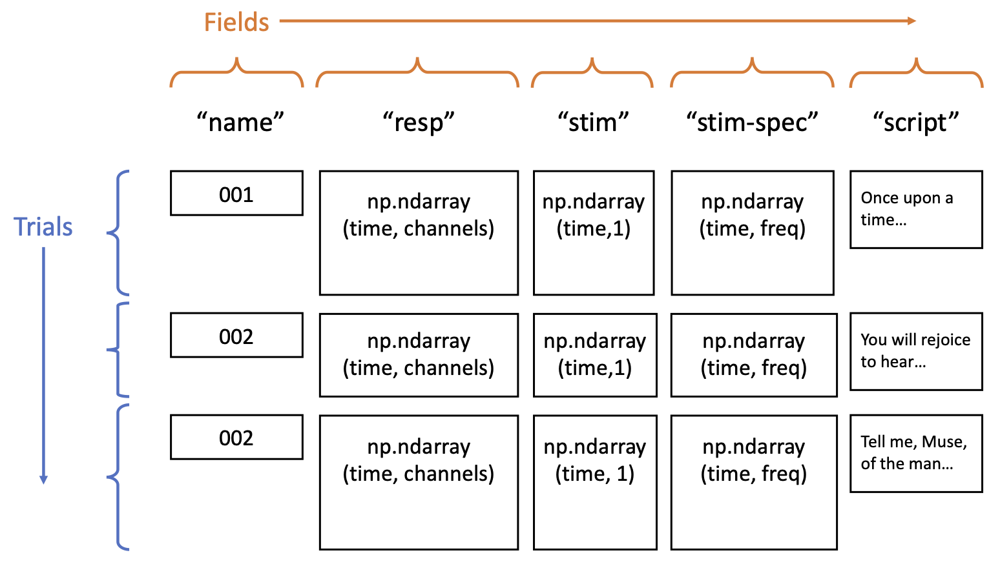

[](https://github.com/naplab/naplib-python/actions)
[](https://codecov.io/gh/naplab/naplib-python)
[](https://badge.fury.io/py/naplib)
[](https://opensource.org/licenses/MIT)

# naplib-python
Tools and functions for neural acoustic data processing and analysis in python. The documentation can be acccessed at the link below. It contains the API reference as well as example notebooks.

- [**Documentation**](https://naplib-python.readthedocs.io/en/latest/index.html)
- [**Examples**](https://naplib-python.readthedocs.io/en/latest/examples/index.html)
- [**Changelog**](https://naplib-python.readthedocs.io/en/latest/changelog.html)

## Installation

naplib-python is available on PyPi. To install or update this package with pip, run the following command:

```bash
pip install naplib
```

To upgrade the version, run:

```bash
pip install --upgrade naplib
```

## API

The basic data structure for storing neural recording data is the ``Data`` object, which contains neural recordings and other variables associated with different trials such as stimuli and other metadata. Examples of loading and using this data structure can be found in the documentation and the docs/examples/ folder.

### ``Data`` Structure Schematic

<p align="center">
  
</p>

## Contributions

naplib-python is built by the [Neural Acoustic Processing Lab](http://naplab.ee.columbia.edu/) at Columbia University. We primarily use it for processing neural data coming from electrocorticography (ECoG) and electroencephalography (EEG) along with paired audio stimuli in order to study the auditory cortex. You are free to use the software according to its license, and we welcome contributions if you would like to propose changes, additions, or fixes. See our [**contribution guide**](https://naplib-python.readthedocs.io/en/latest/contributing.html) for more details.

## Backlog

The following items are ToDo items on the backlog:

- Look into data parallelization methods for the Data object and associated methods
- Consider making the Data object a [dataclass](https://docs.python.org/3/library/dataclasses.html)
- Implement functionality to write Data objects to MATLAB formats (possibly EEGLab formats)
- Add support for other regularization methods for the TRF class, such as L1 or even mixtures of L1 and L2 together (L1 over features, L2 over time)
- Add general fitter object which allows easy fitting (and cross-val) for ML models of the user's specification

